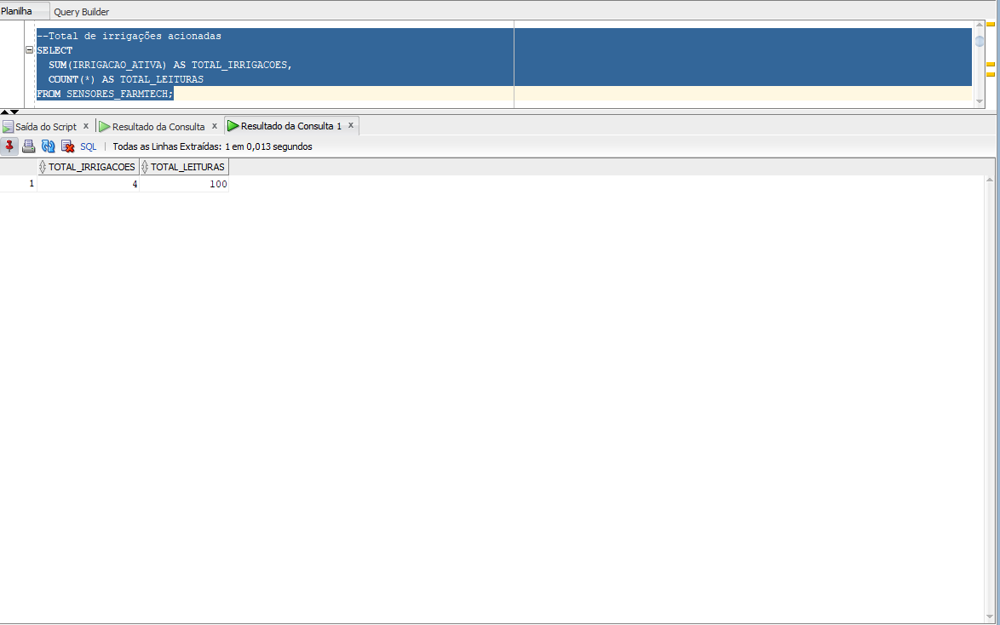
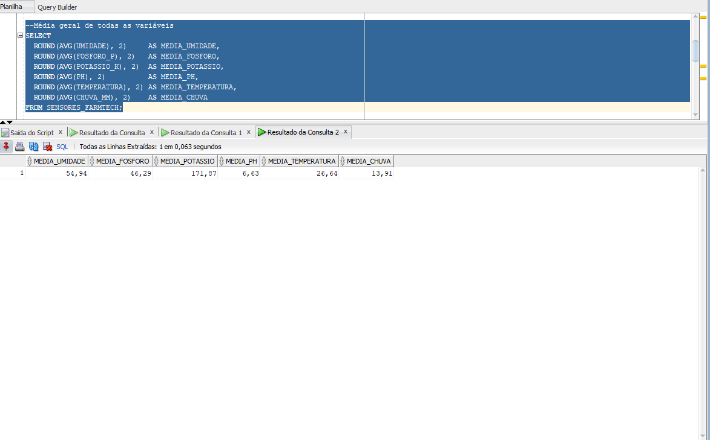

# FIAP - Faculdade de Informática e Administração Paulista

[](https://www.fiap.com.br/)

# Cap 1 - Etapas de uma Máquina Agrícola


##  Integrantes:

- Murilo Rocha Pinto

## Professores:

### Tutor(a)

- Sabrina Otoni

### Coordenador(a)

- Sabrina Otoni

---

##  Descrição

 Comecei utilizando Python, gerei dados simulando sensores agrícolas, com informações como umidade do solo, fósforo, potássio, pH, temperatura e chuva. Inicialmente, tudo foi salvo em arquivos CSV. Depois, o desafio foi importar esses dados para um banco Oracle e começar a analisá-los usando SQL.

Também criei uma lógica simples de irrigação automática: quando o solo estava seco e não havia chuva, a irrigação era acionada. A ideia era deixar a simulação mais próxima de uma situação real no campo.

Durante o processo, enfrentei um problema bastante comum em projetos de dados: o Oracle não reconhecia corretamente os números do CSV por causa do formato decimal. Pode parecer algo pequeno, mas resolver esse erro na prática trouxe muito aprendizado sobre integração de sistemas e tratamento de dados.

Com os dados funcionando no banco, comecei a fazer consultas SQL para entender melhor as informações geradas. Consegui identificar quantas vezes a irrigação foi ativada, os períodos mais secos, momentos em que o pH saiu do ideal, além dos valores máximos e mínimos registrados pelos sensores.

Todo o projeto foi organizado no GitHub, com os códigos em Python, consultas SQL, base de dados e registros das etapas, permitindo que qualquer pessoa consiga acompanhar e reproduzir a solução.

---


##  Banco de Dados Oracle

### Conexão utilizada

| Parâmetro | Valor |
|-----------|-------|
| Host | oracle.fiap.com.br |
| Porta | 1521 |
| SID | ORCL |
| Ferramenta | Oracle SQL Developer |

### Tabela: `SENSORES_FARMTECH`

| Coluna | Tipo | Descrição |
|--------|------|-----------|
| DATA_HORA | DATE | Data e hora da leitura |
| UMIDADE | NUMBER | Umidade do solo (%) |
| FOSFORO_P | NUMBER | Fósforo no solo (mg/kg) |
| POTASSIO_K | NUMBER | Potássio no solo (mg/kg) |
| PH | NUMBER | pH do solo |
| TEMPERATURA | NUMBER | Temperatura ambiente (°C) |
| CHUVA_MM | NUMBER | Precipitação (mm) |
| IRRIGACAO_ATIVA | NUMBER | 1 = irrigação acionada / 0 = não acionada |

### Prints das consultas


**Todos os registros:**

.png)
.png)
.png)
fim.png)

**Total de irrigações:**


**Médias das variáveis:**



**Solo seco (umidade < 40%):**


**pH fora do ideal:**

.png)
.png)
fim.png)

**Chuva forte (> 20mm):**


**Máximos e mínimos:**


---

## Como executar o código

### Pré-requisitos

- Pycharm instalado (para facilitar a utilização do python)
- Python 3.x instalado
- Oracle SQL Developer instalado

### Passo a passo

**1. Gerar os dados dos sensores:**

```bash
# Clone o repositório
git clone https://github.com/murrocha/FIAP-GRAD-ON-IA-RM573472-.git
cd FASE3
cd Cap 1 - Etapas de uma Máquina Agrícola
cd src

# Execute o script gerador
python scripts/gerar_dados_sensores.py
```

Isso vai criar o arquivo `dados_sensores_farmtech.csv` na pasta atual.

**2. Importar no Oracle SQL Developer:**

- Abra o Oracle SQL Developer
- Conecte ao banco: `oracle.fiap.com.br` | porta `1521` | SID `ORCL`
- Clique com botão direito em **Tabelas (Filtrado)** → **Importar Dados**
- Selecione o CSV gerado, com delimitador `;` e decimal `,`
- Defina o nome da tabela como `SENSORES_FARMTECH`
- Finalize a importação

**3. Executar as consultas SQL:**

Abra o arquivo `scripts/consultas.sql` no SQL Developer e execute com **Ctrl+Enter**.

---

##  Licença

[](http://creativecommons.org/licenses/by/4.0/?ref=chooser-v1)
[](http://creativecommons.org/licenses/by/4.0/?ref=chooser-v1)

[MODELO GIT FIAP](https://github.com/agodoi/template) por [FIAP](https://fiap.com.br) está licenciado sobre [Attribution 4.0 International](http://creativecommons.org/licenses/by/4.0/?ref=chooser-v1).
